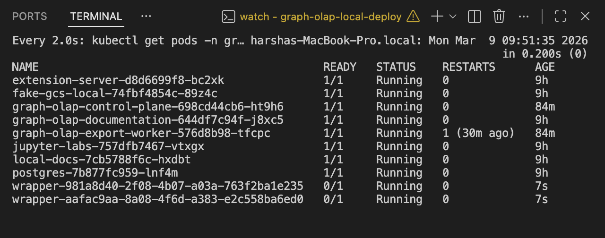
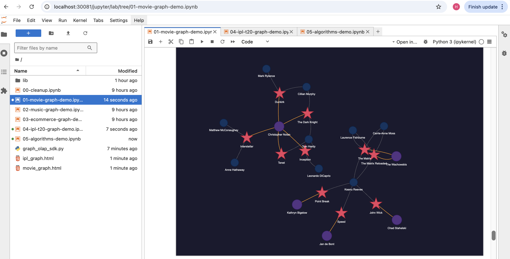

# Graph OLAP

**Turn your warehouse data into a queryable graph in under 30 seconds. Sub-millisecond traversals. Fully isolated per analyst. Runs on your laptop.**

---

## What is this, in plain English?

Imagine you work at a bank. You have millions of rows of transactions in a data warehouse. Your job is to find fraud — specifically, to find groups of accounts that are secretly connected through shared devices, shared addresses, or circular money transfers.

In SQL, finding a chain of 4 connected accounts looks like this:

```sql
-- Just to find 4-hop connections — already painful
SELECT a1.id, a2.id, a3.id, a4.id
FROM accounts a1
JOIN transactions t1 ON t1.from_account = a1.id
JOIN accounts a2 ON t1.to_account = a2.id
JOIN transactions t2 ON t2.from_account = a2.id
JOIN accounts a3 ON t2.to_account = a3.id
JOIN transactions t3 ON t3.from_account = a3.id
JOIN accounts a4 ON t3.to_account = a4.id
WHERE a1.id = 12345
-- Runtime on 10M rows: ~4 minutes
```

In a graph database, the same query is:

```cypher
MATCH (a:Account {id: 12345})-[:TRANSFERRED*1..4]->(suspect:Account)
RETURN suspect
-- Runtime: 2ms
```

**Graph OLAP bridges that gap.** It takes your existing warehouse data and lets any analyst spin up their own private in-memory graph — instantly, without any database administration, without touching production systems.

---

## The Problem This Solves

Most companies have their data in a warehouse (Snowflake, BigQuery, Databricks, Starburst). That warehouse is great for aggregations and reports. It is terrible for relationship traversals — finding who is connected to whom, how many hops away, through what path.

The bottleneck is not compute power. It is the wrong data structure. Relational tables were designed for rows. Graphs were designed for connections.

Three things make this hard to fix today:

**1. Loading data into a graph database is a full engineering project.**
You need a dedicated ETL pipeline. Someone has to maintain it. It goes stale. When schema changes, it breaks. Most teams never get past the proof-of-concept stage.

**2. Graph databases are shared infrastructure.**
Neo4j, TigerGraph, Amazon Neptune — these are all shared services. One analyst's heavy query slows everyone else down. You cannot give each analyst their own isolated environment without paying for multiple full database licences.

**3. There is no self-service layer.**
A data analyst cannot just say "I want to explore the customer graph for Q3 data." They have to file a ticket, wait for engineering, and get a fixed dataset loaded into a shared database they do not control.

---

## What Graph OLAP Does Differently

| | Traditional Graph DB | Graph OLAP |
|---|---|---|
| Data loading | Manual ETL pipeline | Automated — define a SQL query, press go |
| Isolation | Shared cluster | Each analyst gets their own pod |
| Setup time | Days to weeks | 30 seconds from definition to query |
| Cost when idle | Full database running 24/7 | Pod deleted after TTL, zero idle cost |
| Self-service | Requires DBA/engineering | Analyst does it themselves via API or notebook |
| Local development | Requires cloud or VPN | Runs entirely on a laptop |

The insight is simple: **graph databases are fastest when the data fits in memory**. Instead of one big shared graph, spin up many small ephemeral graphs — one per analyst, one per question, one per time window. Kubernetes makes this cheap. Parquet makes the data portable.

---

## How It Works

```text
Analyst defines a Mapping (which SQL tables → nodes, which → edges)
        │
        ▼
Analyst creates an Instance ("give me this as a graph, TTL = 4 hours")
        │
        ▼
Export Worker runs UNLOAD on Starburst → writes Parquet to GCS
        │
        ▼
Reconciler detects ready snapshot → Kubernetes spawns a Wrapper Pod
        │
        ▼
Wrapper Pod downloads Parquet → loads graph into FalkorDB or KuzuDB (~200k rows/sec)
        │
        ▼
Analyst queries via Cypher → result in milliseconds ⚡
        │
        ▼
TTL expires → pod deleted → Parquet stays in GCS → recreate anytime
```

Each analyst gets a **completely isolated pod**. One analyst's 10-million-node graph cannot slow down another analyst's query.

---

## Real-World Use Cases

### Fraud Detection — Banking
> *"Show me every account within 3 hops of this suspicious account, connected through transactions over £10,000 in the last 30 days."*

In SQL: 6 self-joins, multiple CTEs, 5+ minutes on a large dataset.
In Graph OLAP: one Cypher query, 3ms.

### Anti-Money Laundering (AML)
> *"Find circular money flows — money that leaves account A and returns to account A within 5 hops."*

Classic cycle detection. Impossible in SQL without recursive CTEs that time out. Natural in a graph traversal.

### Supply Chain Risk
> *"Which of our tier-1 suppliers depend on the same tier-3 component manufacturer? If that factory goes down, what products are affected?"*

Map the entire dependency graph. Run shortest-path. Identify single points of failure in seconds.

### Customer 360 / Recommendation
> *"Customers who bought the same products as this customer, but from different regions — who are they and what else did they buy?"*

Multi-hop co-purchase traversal. SQL requires multiple joins across large tables. Graph returns it in one pattern match.

### Knowledge Graphs / HR / IT
> *"Who in the organisation has access to system X, through what role chain, and who approved each step?"*

Access control chains, org hierarchies, IT dependency graphs — all relationship problems that graphs handle naturally.

---

## Why Does This Not Exist in the Industry Already?

It partly does — but with significant gaps:

**Neo4j AuraDS / Bloom**: Excellent graph database. But loading data still requires you to build and maintain your own ETL pipeline. It is a shared managed service — not ephemeral, not per-analyst isolated, not self-service from a warehouse. Expensive at scale.

**TigerGraph**: Enterprise-only, complex setup, no self-service. Requires dedicated graph engineering team.

**Amazon Neptune**: Cloud-only, no local dev story, not ephemeral. Still needs custom data loading.

**Databricks GraphX / Graph Neural Networks**: Batch processing — minutes per query, not designed for interactive traversal.

**Snowflake / BigQuery graph extensions**: Emerging, but still SQL-based. Cannot do arbitrary-depth traversals efficiently.

**The gap Graph OLAP fills**: Nobody has built an *ephemeral, per-analyst, self-service, warehouse-native* graph layer. The pieces existed (Kubernetes, Parquet, FalkorDB/KuzuDB) but were not assembled into a platform. The key innovations here are:

1. **Mapping as a first-class object** — define once, reuse across many instances and time windows
2. **Ephemeral pods** — pay for memory only when querying; zero idle cost
3. **Analyst self-service** — no DBA, no ETL team, no ticket
4. **Local-first** — full platform runs on a laptop with one command; production uses the same Helm charts

---

## Architecture

```text
┌─────────────────────────────────────────────────────────────────┐
│                    localhost:30081 (nginx ingress)               │
│                                                                  │
│   /api/*    ──►  Control Plane (FastAPI + Python)                │
│   /jupyter  ──►  Jupyter Labs                                    │
│   /health   ──►  Health check                                    │
└──────────────────────┬──────────────────────────────────────────┘
                       │
          ┌────────────▼─────────────┐
          │      Control Plane        │  FastAPI · Python
          │  - REST API               │  Manages: mappings, snapshots,
          │  - Kubernetes API client  │  instances, users
          │  - Reconciliation loop    │  Spawns/deletes wrapper pods
          └──────┬──────────┬────────┘
                 │          │
    ┌────────────▼──┐  ┌────▼──────────────────┐
    │  PostgreSQL   │  │    Export Worker       │  Python
    │  (metadata)   │  │  Polls export jobs     │
    │  mappings     │  │  → Starburst UNLOAD    │
    │  snapshots    │  │  → Parquet to GCS      │
    │  instances    │  └────────────────────────┘
    └───────────────┘            │
                                 │ Parquet files
                       ┌─────────▼──────────┐
                       │  GCS / fake-gcs    │  Cloud Storage
                       │  (Parquet store)   │  or local emulator
                       └─────────┬──────────┘
                                 │ Download on startup
          ┌──────────────────────▼──────────────────────┐
          │        Wrapper Pod  (one per analyst)        │
          │                                              │
          │   ┌──────────────┐  or  ┌─────────────────┐ │
          │   │   FalkorDB   │      │     KuzuDB       │ │
          │   │  Redis-based │      │  Columnar graph  │ │
          │   │  fast lookup │      │  algorithms+scan │ │
          │   └──────────────┘      └─────────────────┘ │
          │                                              │
          │   Cypher query → result in milliseconds ⚡   │
          └──────────────────────────────────────────────┘
```

### Technology Stack

| Layer | Technology | Why |
|---|---|---|
| **API** | FastAPI (Python) | Async REST, lightweight, easy to extend |
| **Graph engine — option A** | [FalkorDB](https://falkordb.com) | Redis-based in-memory graph. Fastest for point lookups and short traversals. OpenCypher query language. |
| **Graph engine — option B** | [KuzuDB](https://kuzudb.com) | Columnar graph database. Better for full graph scans, large datasets, and algorithm workloads (PageRank, BFS, Louvain). |
| **Data format** | Apache Parquet | Columnar, compressed, fast to load. Warehouse-native — every major warehouse can UNLOAD to Parquet. |
| **Warehouse** | Starburst Galaxy (Trino) | SQL query engine over any warehouse. UNLOAD to GCS. Optional — bypassed in local mode. |
| **Storage** | Google Cloud Storage | Durable Parquet store. fake-gcs-local emulates it locally — no GCP account needed for dev. |
| **Orchestration** | Kubernetes | Spawns/deletes wrapper pods on demand. Works on OrbStack, Docker Desktop, minikube, or any K8s cluster. |
| **Packaging** | Helm | Same charts for local dev and production. |
| **Notebooks** | Jupyter Labs | Pre-loaded with Python SDK and 6 demo notebooks. |
| **Algorithms** | NetworkX + Extension Server | PageRank, Betweenness Centrality, Louvain community detection, BFS, Shortest Path. |

### FalkorDB vs KuzuDB — which to pick?

| | FalkorDB | KuzuDB (Ryugraph) |
|---|---|---|
| Best for | Fast lookups, short traversals, low latency | Large scans, graph algorithms, analytical queries |
| Memory model | Redis structures | Columnar (like Parquet in memory) |
| PageRank / BFS | Via Extension Server | Native |
| Query language | OpenCypher | Cypher |
| Choose when | You need speed on a focused subgraph | You need algorithms across the whole graph |

### Services

| Service | Role |
|---|---|
| **Control Plane** | REST API — manages everything, calls K8s API to spawn/delete pods |
| **Export Worker** | Runs Starburst UNLOAD jobs, writes Parquet to GCS |
| **FalkorDB Wrapper** | Wrapper pod using FalkorDB — one spawned per analyst instance |
| **Ryugraph Wrapper** | Wrapper pod using KuzuDB — chosen when algorithms are needed |
| **Jupyter Labs** | Notebook environment with Python SDK + 6 demo notebooks pre-loaded |
| **PostgreSQL** | Stores mappings, snapshots, instances, users |
| **Extension Server** | Provides graph algorithm extensions to wrapper pods |
| **Fake GCS Server** | In-cluster GCS emulator — zero cloud setup needed locally |

---

## Tested & Validated

### All pods running — verified on MacBook Pro



### Movie graph — actor/director network, queried in 1ms (notebook 01)

Loaded from synthetic Parquet via fake-gcs-local. Cypher traversal across actors, directors, movies — **1ms response time**. Rendered with PyVis.



### IPL T20 cricket graph — player/team/venue network (notebook 04)

Players, teams, matches, seasons — full graph analytics on cricket stats data.


### End-to-end test run

```text
✓ Mapping created               mapping_id=19
✓ Instance created              instance_id=19, snapshot_id=19
✓ Parquet uploaded to fake-gcs  e2e@test.com/19/v1/19/nodes/Movie/
✓ Snapshot marked ready         postgres UPDATE snapshots SET status='ready'
✓ Wrapper pod reached Running   ~25 seconds
✓ Cypher query returned         3 actors, 3 movies, ACTED_IN traversal — 1ms
✓ Cleanup complete
```

---

## Demo Notebooks

Six notebooks pre-loaded in Jupyter Labs — no credentials, no cloud account, all synthetic data:

| # | Notebook | What it shows |
|---|---|---|
| `00` | `00-cleanup.ipynb` | List and bulk-delete instances |
| `01` | `01-movie-graph-demo.ipynb` | Actor/director/movie graph — Cypher queries, PyVis |
| `02` | `02-music-graph-demo.ipynb` | Artist/album/track — multi-hop traversals, genre analysis |
| `03` | `03-ecommerce-graph-demo.ipynb` | Product/customer/order — recommendation queries |
| `04` | `04-ipl-t20-graph-demo.ipynb` | Cricket stats — player/team/match relationships |
| `05` | `05-algorithms-demo.ipynb` | Co-actor network — PageRank, Betweenness, Louvain, PyVis |

---

## Quick Start

```bash
cd graph-olap-local-deploy

# Optional — configure real Starburst + GCS credentials
# Skip this to run all 6 demo notebooks on synthetic data
make secrets

# Build all Docker images (~10 min first time)
make build

# Deploy to local Kubernetes
make deploy
```

| Endpoint | What it is |
|---|---|
| `http://localhost:30081/jupyter/lab` | Jupyter Labs — open and run any notebook |
| `http://localhost:30081/api/...` | Control Plane REST API |
| `http://localhost:30081/health` | Health check |
| `http://localhost:30082` | Full documentation site |

Full setup guide: [`graph-olap-local-deploy/README.md`](graph-olap-local-deploy/README.md)

---

## Repository Layout

| Folder | What it is |
|---|---|
| [`graph-olap/`](graph-olap/) | Service source code — control-plane, export-worker, FalkorDB wrapper, KuzuDB wrapper, Python SDK |
| [`graph-olap-local-deploy/`](graph-olap-local-deploy/) | Local deployment — Helm charts, Kubernetes manifests, scripts, demo notebooks, docs |
